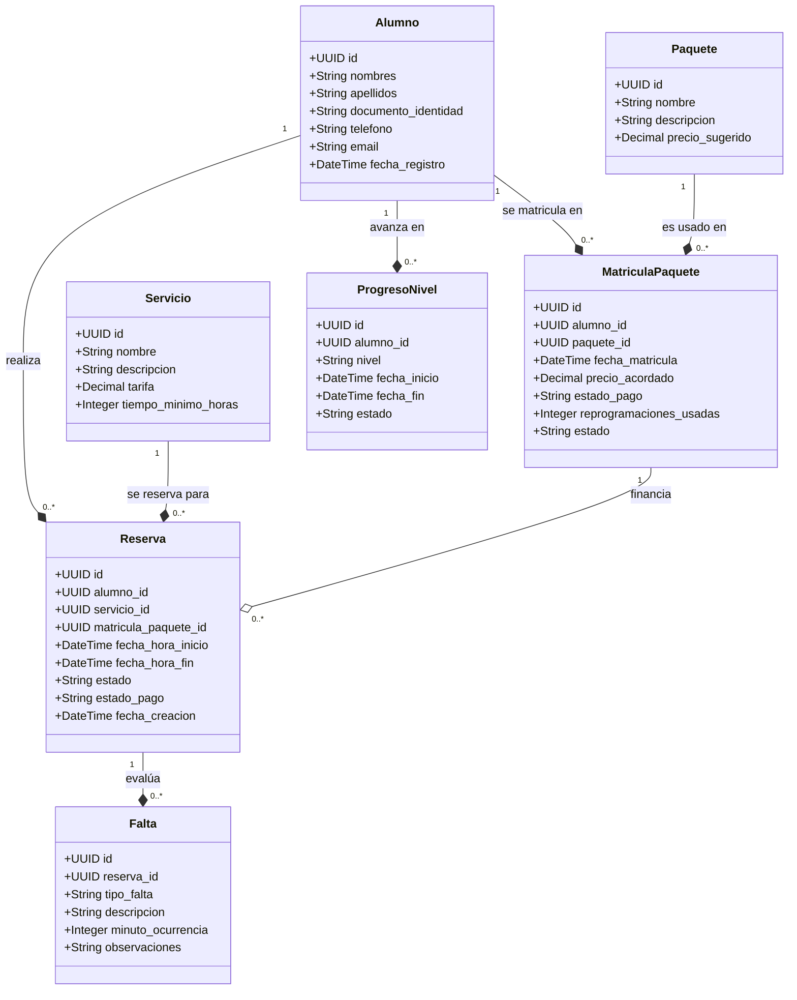

# Especificación Técnica: Modelo de Dominio
**Propósito**: Definir las entidades del negocio, sus atributos, relaciones y las reglas de negocio invariantes aplicadas en el MVP de la Academia de Manejo San Cristóbal VIP.

---

## 1. Diagrama Conceptual de Entidades (Mermaid)

---

## 2. Definición Detallada de Entidades y Atributos

### 2.1 Alumno
Representa al estudiante registrado en la academia.

| Atributo | Tipo | Descripción | Restricciones |
|---|---|---|---|
| `id` | UUID | Identificador único del alumno. | Clave Primaria |
| `nombres` | String | Nombre(s) del alumno. | Requerido |
| `apellidos` | String | Apellido(s) del alumno. | Requerido |
| `documento_identidad`| String | DNI o Carnet de Extranjería. | Único, Requerido |
| `telefono` | String | Número de contacto telefónico. | Requerido, formato local de Perú |
| `email` | String | Correo electrónico del alumno. | Opcional, formato válido |
| `fecha_registro` | DateTime | Fecha y hora de creación del registro. | Requerido |

### 2.2 Servicio
Catálogo de servicios individuales ofrecidos por la academia.

| Atributo | Tipo | Descripción | Restricciones |
|---|---|---|---|
| `id` | UUID | Identificador único del servicio. | Clave Primaria |
| `nombre` | String | Nombre del servicio (ej. "Simulacro Tipo Examen", "Circuito Libre"). | Único, Requerido |
| `descripcion` | String | Explicación comercial del servicio. | Requerido |
| `tarifa` | Decimal | Costo del servicio en Soles (S/). | Requerido, >= 0.00 (S/ 40.00 para simulacro/circuito) |
| `tiempo_minimo_horas`| Integer | Duración mínima obligatoria en horas. | Requerido, >= 1 |

### 2.3 Paquete
Programas de formación estructurados que agrupan múltiples clases y niveles.

| Atributo | Tipo | Descripción | Restricciones |
|---|---|---|---|
| `id` | UUID | Identificador único del paquete. | Clave Primaria |
| `nombre` | String | Nombre del paquete (ej. "Paquete San Cristóbal"). | Único, Requerido |
| `descripcion` | String | Detalle de lo que incluye el paquete. | Requerido |
| `precio_sugerido` | Decimal | Precio sugerido de venta. | Opcional (se define al matricularse) |

### 2.4 MatriculaPaquete
Registro de la inscripción de un alumno a un paquete específico.

| Atributo | Tipo | Descripción | Restricciones |
|---|---|---|---|
| `id` | UUID | Identificador único de la matrícula. | Clave Primaria |
| `alumno_id` | UUID | Referencia al alumno matriculado. | Clave Foránea a Alumno |
| `paquete_id` | UUID | Referencia al paquete seleccionado. | Clave Foránea a Paquete |
| `fecha_matricula` | DateTime | Fecha de inscripción. | Requerido |
| `precio_acordado` | Decimal | Tarifa final acordada al momento de la venta. | Requerido, >= 0.00 |
| `estado_pago` | String | Estado de pago presencial: `pendiente`, `pagado_presencial`. | Requerido (diseño extensible a pasarela futura) |
| `reprogramaciones_usadas` | Integer | Contador de reprogramaciones gratuitas consumidas. | Requerido, inicializado en 0, Max 2 |
| `estado` | String | Estado de la matrícula: `activo`, `completado`, `cancelado`. | Requerido |

### 2.5 Reserva
Reserva horaria de una sesión práctica de un servicio específico.

| Atributo | Tipo | Descripción | Restricciones |
|---|---|---|---|
| `id` | UUID | Identificador único de la reserva. | Clave Primaria |
| `alumno_id` | UUID | Referencia al alumno que reserva. | Clave Foránea a Alumno |
| `servicio_id` | UUID | Referencia al servicio que se impartirá. | Clave Foránea a Servicio |
| `matricula_paquete_id` | UUID | Referencia a la matrícula (opcional, null si es servicio individual). | Clave Foránea a MatriculaPaquete (Opcional) |
| `fecha_hora_inicio` | DateTime | Fecha y hora de inicio de la sesión. | Requerido |
| `fecha_hora_fin` | DateTime | Fecha y hora de fin de la sesión. | Requerido, posterior a `fecha_hora_inicio` |
| `estado` | String | Estados: `pendiente_confirmacion`, `confirmada`, `asistida`, `no_asistio`, `cancelada`, `reprogramada`. | Requerido |
| `estado_pago` | String | Estado de pago de la sesión: `pendiente`, `pagado_presencial`. | Requerido |
| `fecha_creacion` | DateTime | Fecha de registro de la reserva. | Requerido |

### 2.6 ProgresoNivel
Seguimiento de la evolución pedagógica del alumno.

| Atributo | Tipo | Descripción | Restricciones |
|---|---|---|---|
| `id` | UUID | Identificador único del registro de progreso. | Clave Primaria |
| `alumno_id` | UUID | Referencia al alumno. | Clave Foránea a Alumno |
| `nivel` | String | Nivel actual: `Básico`, `Intermedio`, `Pre-examen`. | Requerido |
| `fecha_inicio` | DateTime | Fecha en que el alumno ingresa al nivel. | Requerido |
| `fecha_fin` | DateTime | Fecha en que el alumno completa el nivel. | Opcional |
| `estado` | String | Estado del nivel: `en_progreso`, `completado`. | Requerido |

### 2.7 Falta
Evaluación detallada de infracciones cometidas por el alumno durante simulacros prácticos.

| Atributo | Tipo | Descripción | Restricciones |
|---|---|---|---|
| `id` | UUID | Identificador único del registro de falta. | Clave Primaria |
| `reserva_id` | UUID | Referencia a la reserva (sesión) donde ocurrió la falta. | Clave Foránea a Reserva (debe ser de tipo Simulacro) |
| `tipo_falta` | String | Gravedad de la falta: `Leve`, `Grave`, `Eliminatoria`. | Requerido |
| `descripcion` | String | Descripción de la falta cometida (ej. "No usar luces direccionales"). | Requerido |
| `minuto_ocurrencia` | Integer | Minuto en el que se cometió la infracción dentro de la sesión. | Opcional, >= 0 |
| `observaciones` | String | Comentarios y recomendaciones adicionales del instructor. | Opcional |

---

## 3. Reglas de Negocio Invariantes

### RN01: Restricción de Anticipación para Reservas
* **Descripción**: Las reservas de tipo "Circuito Libre" deben ser agendadas con un tiempo mínimo de anticipación.
* **Invariante**: `Reserva.fecha_hora_inicio - Reserva.fecha_creacion >= 2 horas` (Solo aplicable cuando `Servicio.nombre == "Circuito Libre"`).
* **Criterio de Aceptación**: Intentar crear una reserva para dentro de 1 hora y 30 minutos debe fallar con un error de validación de negocio de tipo HTTP 400.

### RN02: Plazo de Cancelación y Reprogramación
* **Descripción**: Las cancelaciones y reprogramaciones deben ser notificadas con un tiempo mínimo antes de la clase.
* **Invariante**: `Reserva.fecha_hora_inicio - DateTime.now() >= 2 horas`.
* **Criterio de Aceptación**:
  * Si un alumno cancela o reprograma con >= 2 horas de anticipación, la reserva cambia a `cancelada` o `reprogramada` y el cupo/clase se libera (en el paquete no consume saldo).
  * Si la cancelación ocurre con < 2 horas de anticipación, el sistema rechaza la solicitud de cancelación gratuita. La clase se marca como `no_asistio` o `cancelada_tardia` y, en el caso de paquetes, se contabiliza como consumida sin derecho a recuperación.

### RN03: Límite de Reprogramaciones Gratuitas
* **Descripción**: Los alumnos inscritos en el "Paquete San Cristóbal" tienen derecho a un número máximo de reprogramaciones sin costo adicional.
* **Invariante**: Para una `MatriculaPaquete`, el campo `reprogramaciones_usadas` no debe exceder de 2.
* **Criterio de Aceptación**: Al solicitar una reprogramación a tiempo (RN02), si `reprogramaciones_usadas < 2`, se incrementa en 1 el contador y se crea la nueva reserva asociada sin costo adicional. Si `reprogramaciones_usadas == 2`, el sistema deniega la reprogramación automática gratuita. El alumno debe realizar un pago presencial de reprogramación (equivalente a S/ 40.00) registrado como una reserva de sesión individual pagada.

### RN04: Control de Asistencia y Atrasos
* **Descripción**: El alumno dispone de un margen de tolerancia para iniciar su clase.
* **Regla**: Un retraso superior a 15 minutos en el inicio de la clase faculta al instructor a cancelar la clase. Si el alumno solicita la reprogramación de esta clase cancelada por atraso, se procesa bajo la regla RN03 (consume 1 de las 2 reprogramaciones disponibles o se cobra por separado).

---

## 4. Referencias Cruzadas

- [00-vision-general.md](file:///C:/Users/HENRY/Desktop/PROYECTO_FINAL/Spec/docs/specs/00-vision-general.md): Alcance general y exclusión de flota vehicular.
- [03-esquema-base-datos.md](file:///C:/Users/HENRY/Desktop/PROYECTO_FINAL/Spec/docs/specs/03-esquema-base-datos.md): Representación relacional (SQL) del modelo de dominio.
- [04-api-endpoints.md](file:///C:/Users/HENRY/Desktop/PROYECTO_FINAL/Spec/docs/specs/04-api-endpoints.md): Endpoints para interactuar con las entidades y aplicar las reglas de negocio.
- [07-estrategia-pruebas.md](file:///C:/Users/HENRY/Desktop/PROYECTO_FINAL/Spec/docs/specs/07-estrategia-pruebas.md): Estrategia de testing unitario para validar las invariantes RN01, RN02 y RN03.
