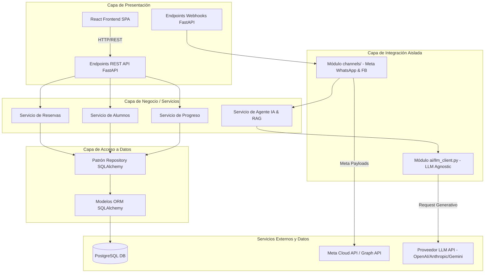

# Especificación Técnica: Arquitectura de Software
**Propósito**: Definir la estructura arquitectónica del monolito, la organización de carpetas del backend y frontend, y el diseño de los módulos aislados para integraciones externas.

---

## 1. Diagrama de Arquitectura de Capas (Mermaid)

El sistema se diseña bajo un patrón de **Arquitectura en Capas Tradicional**, alojado en un único servicio ejecutable (Monolito), estructurado de la siguiente forma:



---

## 2. Justificación del Stack Tecnológico del Frontend

Para el panel de administración y el chat de alumnos en la web, se propone utilizar **React + Vite + TypeScript**.

### Justificación:
1. **Velocidad y Ligereza (Vite)**: Vite ofrece un entorno de desarrollo con Hot Module Replacement (HMR) extremadamente veloz, reduciendo tiempos de compilación para el MVP.
2. **Simplicidad de Monolito**: Se compila a activos estáticos indexados (HTML, JS, CSS) que pueden ser servidos directamente por FastAPI o desplegados en servicios estáticos sencillos.
3. **Ecosistema y Formularios**: React posee el ecosistema más maduro para interfaces de administración. Librerías como `React Hook Form` (validación de datos) y `TanStack Query` (sincronización de estado del backend) aceleran la construcción de las vistas de reserva e historial de faltas.
4. **Tipado Estricto**: TypeScript previene errores de coincidencia de esquemas con el backend a nivel de compilación, utilizando los mismos tipos de datos de las respuestas del API.

---

## 3. Estructura de Directorios

### 3.1 Backend (FastAPI)
```
/backend
├── app/
│   ├── main.py              # Punto de entrada de la aplicación FastAPI
│   ├── core/
│   │   ├── config.py        # Configuración centralizada y variables de entorno
│   │   ├── database.py      # Configuración del Engine de SQLAlchemy y SessionLocal
│   │   └── security.py      # Utilidades de hashing y JWT para autenticación
│   ├── models/              # Modelos SQLAlchemy (mapeo directo a tablas de base de datos)
│   ├── schemas/             # Esquemas de Pydantic v2 para validación de Request/Response
│   ├── repositories/        # Consultas crudas y accesos a BD (Patrón Repository)
│   ├── services/            # Lógica y reglas de negocio (RN01, RN02, RN03)
│   ├── routers/             # Rutas y controladores REST expuestos
│   │   ├── auth.py          # Autenticación y token JWT
│   │   ├── alumnos.py       # CRUD y progreso del alumno
│   │   ├── reservas.py      # Creación y reprogramación de reservas
│   │   └── admin.py         # Tableros del instructor y faltas
│   ├── channels/            # Módulo de integración con Meta (Aislado)
│   │   ├── __init__.py
│   │   ├── base.py          # Definición de interfaces abstractas de comunicación
│   │   ├── whatsapp.py      # Conectividad con la API de WhatsApp Cloud
│   │   ├── facebook.py      # Conectividad con la API de FB Messenger
│   │   └── router.py        # Endpoints para recepción de webhooks de Meta
│   └── ai/                  # Módulo del Agente de Inteligencia Artificial (Aislado)
│       ├── __init__.py
│       ├── llm_client.py    # Cliente agnóstico del proveedor de LLM
│       └── rag_service.py   # Motor de búsqueda semántica e inyección de contexto
├── Alembic/                 # Migraciones de base de datos
├── tests/                   # Suite de pruebas automatizadas con pytest
├── Dockerfile               # Configuración de contenedorización
└── requirements.txt         # Dependencias del backend
```

### 3.2 Frontend (React + Vite)
```
/frontend
├── src/
│   ├── assets/              # Recursos estáticos (logotipos, iconos)
│   ├── components/          # Componentes visuales genéricos e interactivos
│   ├── features/            # Agrupación por lógica funcional de vistas
│   │   ├── auth/            # Formularios de Login y lógica de sesión
│   │   ├── alumnos/         # Detalle de alumnos, progreso e historial
│   │   ├── reservas/        # Calendarios de reserva y programación de turnos
│   │   └── evaluaciones/    # Formulario de faltas y retroalimentación escrita
│   ├── hooks/               # Custom hooks globales
│   ├── services/            # Clientes HTTP (llamadas a endpoints FastAPI con Axios/Fetch)
│   ├── styles/              # Archivos de estilos CSS globales y variables
│   ├── App.tsx              # Ruteador principal y layouts de diseño
│   └── main.tsx             # Inicialización de la aplicación React
├── index.html               # Plantilla HTML base
├── vite.config.ts           # Configuración del bundler Vite
├── tsconfig.json            # Configuración del compilador TypeScript
└── Dockerfile               # Configuración de contenedorización para producción
```

---

## 4. Diseño del Aislamiento de Integraciones

### 4.1 Módulo de Canales (`channels/`)
Este módulo se encarga exclusivamente de interactuar con la infraestructura de mensajería de Meta (WhatsApp y Facebook Messenger). 
- **Entrada**: Posee un controlador (`router.py`) que recibe las peticiones POST de los webhooks de Meta. Valida los tokens de verificación y descodifica los payloads JSON complejos propios de Meta a estructuras de datos internas simples (ej. `IncomingMessage(sender_id, text, provider)`).
- **Salida**: Provee métodos estables para enviar mensajes (ej. `enviar_texto(destinatario_id, texto)`). Toda lógica para transformar el mensaje en el JSON requerido por Meta (e.g. `messaging_type`, `recipient`) se encapsula dentro del archivo del canal respectivo (`whatsapp.py` o `facebook.py`).
- **Independencia**: La lógica de negocio principal y el agente de IA no conocen el formato de Meta. Si la API de WhatsApp actualiza sus esquemas, solo se edita `channels/whatsapp.py`.

### 4.2 Módulo de IA Agnóstico de LLM (`ai/llm_client.py`)
Dado que el proveedor del Modelo de Lenguaje (LLM) no está decidido (OpenAI, Anthropic, Gemini, etc.), el sistema previene el acoplamiento directo a SDKs externos.
- **Interfaz Única**: Se define una interfaz en `llm_client.py` con firmas del tipo:
  ```python
  async def generar_respuesta(prompt: str, contexto: str) -> str:
      """Invoca el LLM configurado pasándole el prompt y el contexto de RAG."""
      pass
  ```
- **Implementación Interna**: El archivo `llm_client.py` realiza la importación del SDK del proveedor seleccionado y maneja la conversión de payloads. Las dependencias externas de este SDK (ej. biblioteca `google-genai` u `openai`) solo son importadas y utilizadas dentro de este archivo.
- **Efecto de Cambio**: Si se decide cambiar de proveedor de LLM en el futuro, el único archivo modificado en toda la base de código del monolito es `llm_client.py` (y las credenciales en variables de entorno), protegiendo la lógica de RAG y flujos de conversación de cambios drásticos.

---

## 5. Referencias Cruzadas

- [00-vision-general.md](file:///C:/Users/HENRY/Desktop/PROYECTO_FINAL/Spec/docs/specs/00-vision-general.md): Contexto del monolito y exclusión de flota.
- [04-api-endpoints.md](file:///C:/Users/HENRY/Desktop/PROYECTO_FINAL/Spec/docs/specs/04-api-endpoints.md): Endpoints implementados en los `routers/` de FastAPI.
- [05-agente-ia-rag.md](file:///C:/Users/HENRY/Desktop/PROYECTO_FINAL/Spec/docs/specs/05-agente-ia-rag.md): Flujo detallado y uso del `llm_client.py` por el motor RAG.
- [06-integracion-canales.md](file:///C:/Users/HENRY/Desktop/PROYECTO_FINAL/Spec/docs/specs/06-integracion-canales.md): Detalle de webhooks y payloads en `channels/`.
