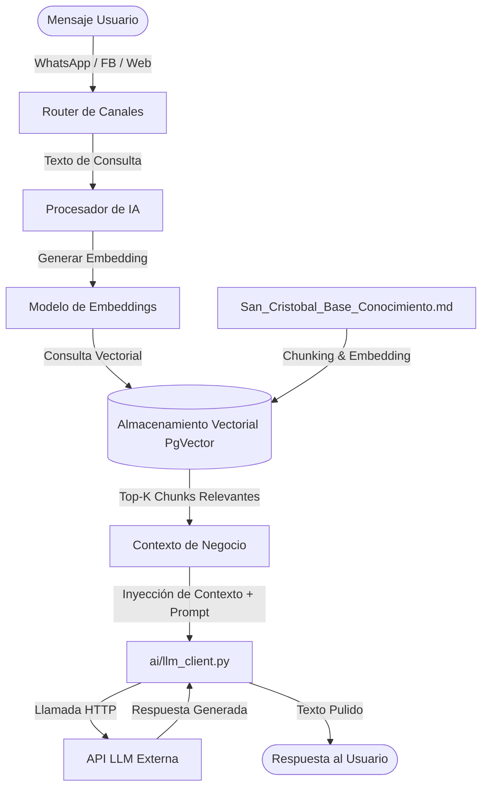

# Especificación Técnica: Agente de IA y RAG
**Propósito**: Definir la arquitectura de la inteligencia artificial conversacional, su motor de generación recuperada (RAG), las herramientas integradas, sus límites operativos y la estrategia de mitigación de alucinaciones.

---

## 1. Arquitectura del Sistema RAG (Retrieval-Augmented Generation)

El agente de IA interactúa de forma autónoma con alumnos y prospectos. Para evitar alucinaciones y garantizar que las respuestas se apeguen estrictamente a la realidad de la academia, se implementa una arquitectura RAG:



### 1.1 Ingesta de Conocimiento
- **Fuente Única de Verdad**: `San_Cristobal_Base_Conocimiento.md`.
- **Estrategia de Particionado (Chunking)**: División del documento markdown por secciones estructurales (encabezados `##` y `###`) para mantener la cohesión del contexto (por ejemplo, la sección de tarifas e inasistencias en un solo bloque).
- **Almacenamiento Vectorial**: Uso de la extensión `pgvector` en la base de datos PostgreSQL del MVP, permitiendo consultas semánticas de similitud de coseno en una sola base de datos consolidada.

---

## 2. Abstracción del Cliente de LLM (Agnóstico de Proveedor)

Como se describe en `02-arquitectura.md`, el sistema no se acopla a ningún proveedor específico (OpenAI, Gemini, Anthropic). Esto se implementa a través de la abstracción `app/ai/llm_client.py`:

```python
# app/ai/llm_client.py
import os
from typing import Optional

class LLMClient:
    def __init__(self):
        self.provider = os.getenv("LLM_PROVIDER", "openai").lower()
        self.api_key = os.getenv("LLM_API_KEY")
        self.model_name = os.getenv("LLM_MODEL")

    async def generar_respuesta(self, prompt_sistema: str, mensaje_usuario: str) -> str:
        """
        Punto de entrada unificado para invocar al LLM. 
        Mapea dinámicamente las llamadas al SDK del proveedor configurado.
        """
        if self.provider == "openai":
            return await self._call_openai(prompt_sistema, mensaje_usuario)
        elif self.provider == "gemini":
            return await self._call_gemini(prompt_sistema, mensaje_usuario)
        elif self.provider == "anthropic":
            return await self._call_anthropic(prompt_sistema, mensaje_usuario)
        else:
            raise ValueError(f"Proveedor de LLM no soportado: {self.provider}")

    async def _call_openai(self, system: str, user: str) -> str:
        # Implementación específica de llamada a OpenAI SDK
        pass

    async def _call_gemini(self, system: str, user: str) -> str:
        # Implementación específica de llamada a Gemini SDK
        pass

    async def _call_anthropic(self, system: str, user: str) -> str:
        # Implementación específica de llamada a Anthropic SDK
        pass
```

---

## 3. Herramientas y Funciones del Agente (Function Calling)

El LLM puede invocar funciones locales mediante especificaciones de esquema JSON (herramientas). En el MVP se definen dos herramientas controladas:

### 3.1 `consultar_disponibilidad(fecha: str)`
- **Descripción**: Permite al agente conocer qué horas están disponibles para reservas de Circuito Libre o Simulacro en una fecha específica.
- **Acción**: Realiza una consulta de lectura en la tabla `reservas` para filtrar horarios ocupados y devolver la lista de horas hábiles disponibles (lunes a viernes de 8:00 a.m. a 6:00 p.m.).

### 3.2 `solicitar_reserva(nombres: str, apellidos: str, documento_identidad: str, telefono: str, servicio_nombre: str, fecha_hora_inicio: str)`
- **Descripción**: Permite registrar el interés del alumno o prospecto en agendar una sesión.
- **Acción**: Si el DNI no existe en `alumnos`, el sistema crea el perfil del prospecto y registra la reserva en estado `pendiente_confirmacion` y `estado_pago` en `pendiente`. El agente le indica al usuario que la reserva ha sido registrada pero requiere validación presencial de pago para ser confirmada.

---

## 4. Límites de Capacidad y Mitigación de Alucinaciones

### 4.1 Prompt del Sistema (Guardrails)
El agente de IA tendrá configurado el siguiente prompt de sistema inmutable:

> Eres el asistente virtual de la Academia de Manejo San Cristóbal VIP.
> Tu objetivo es responder preguntas de alumnos y prospectos basándote exclusivamente en el contexto provisto.
> 
> REGLAS CRÍTICAS:
> 1. Responde ÚNICAMENTE con los datos explícitos del contexto (tarifas, políticas, ubicación).
> 2. Si el usuario realiza una pregunta sobre algo ausente en el contexto (por ejemplo, estado mecánico de vehículos, flota, o descuentos no autorizados), debes responder textualmente: "Lo siento, no dispongo de esa información en mi base de conocimiento. Por favor, visítanos en Jr. Los Morochucos N° 349 o comunícate con atención presencial."
> 3. Las tarifas del Circuito Libre y Simulacro Tipo Examen son estrictamente S/ 40.00 por hora. El Paquete San Cristóbal no tiene tarifa fija pública; debes indicar al usuario que consulte al momento de inscribirse.
> 4. Está terminantemente prohibido inventar o prometer excepciones a las políticas de cancelación (2 horas de anticipación obligatorias) o inasistencias.
> 5. No menciones vehículos ni flota vehicular.

### 4.2 Respuestas de Respaldo ante Errores (Fallback)
Si el proveedor de LLM se encuentra inactivo, excede su cuota o la llamada falla por timeout, la capa de negocio interceptará la excepción y retornará de inmediato un mensaje pre-grabado en el canal de chat (WhatsApp/Messenger/Web):
> *"Hola, en este momento estamos experimentando problemas de conectividad con nuestro asistente virtual. Por favor, visítanos directamente en Jr. Los Morochucos N° 349 (Ayacucho) o llámanos durante nuestro horario de atención (Lunes a Viernes de 8:00 a.m. a 6:00 p.m.) para ayudarte. ¡Gracias por tu comprensión!"*

---

## 5. Referencias Cruzadas

- [00-vision-general.md](file:///C:/Users/HENRY/Desktop/PROYECTO_FINAL/Spec/docs/specs/00-vision-general.md): Casos de uso de prospectos y alumnos que usan el chat.
- [01-modelo-dominio.md](file:///C:/Users/HENRY/Desktop/PROYECTO_FINAL/Spec/docs/specs/01-modelo-dominio.md): Reglas de negocio de tarifas y plazos inyectadas en las validaciones de las herramientas.
- [06-integracion-canales.md](file:///C:/Users/HENRY/Desktop/PROYECTO_FINAL/Spec/docs/specs/06-integracion-canales.md): Flujo de mensajería desde el webhook hasta el procesador de IA.
- [07-estrategia-pruebas.md](file:///C:/Users/HENRY/Desktop/PROYECTO_FINAL/Spec/docs/specs/07-estrategia-pruebas.md): Metodología de pruebas no deterministas sobre el agente de IA.
