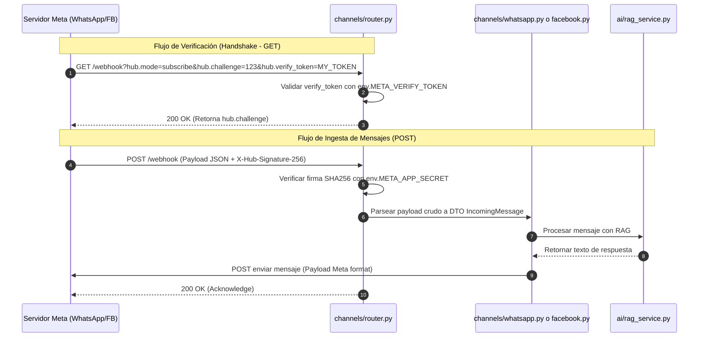

# Especificación Técnica: Integración de Canales (Meta Webhooks)
**Propósito**: Definir el mecanismo de conexión, procesamiento de webhooks, traducción de payloads y gestión de sesiones entre la plataforma y las APIs oficiales de Meta (WhatsApp y Facebook Messenger).

---

## 1. Flujo de Webhook y Autenticación de Meta

Para recibir y enviar mensajes, el backend expone un endpoint unificado `/api/v1/channels/meta/webhook`. Este endpoint maneja dos flujos independientes:



---

## 2. Modelos de Datos de Entrada y Salida (Payloads)

El módulo `channels/` traduce las estructuras específicas de Meta a un modelo de mensajería interno común.

### 2.1 Modelo Interno DTO (Data Transfer Object)
```python
class IncomingMessage(BaseModel):
    sender_platform_id: str  # Teléfono (WhatsApp) o PSID (Facebook)
    platform: str            # "whatsapp" | "facebook"
    text: str                # Contenido del mensaje de texto enviado
```

### 2.2 Payloads de Entrada Crudos (Meta JSON)

#### WhatsApp Cloud API
```json
{
  "object": "whatsapp_business_account",
  "entry": [{
    "id": "WABA_ID",
    "changes": [{
      "value": {
        "messaging_product": "whatsapp",
        "contacts": [{ "wa_id": "51999888777", "profile": { "name": "Juan Perez" } }],
        "messages": [{
          "from": "51999888777",
          "id": "wamid.HBgNNTE5OTk4ODg3NzdV...",
          "timestamp": "1672531199",
          "text": { "body": "Hola, ¿cuál es el precio de la hora de circuito libre?" },
          "type": "text"
        }]
      },
      "field": "messages"
    }]
  }]
}
```

#### Facebook Messenger Graph API
```json
{
  "object": "page",
  "entry": [{
    "id": "PAGE_ID",
    "time": 1672531199000,
    "messaging": [{
      "sender": { "id": "PSID_USER_123" },
      "recipient": { "id": "PAGE_ID" },
      "timestamp": 1672531199000,
      "message": {
        "mid": "mid.m-12345...",
        "text": "Hola, ¿cuál es el precio de la hora de circuito libre?"
      }
    }]
  }]
}
```

---

## 3. Gestión de Sesión y Contexto por Usuario

Para mantener una conversación fluida (historial de chat) y relacionar a los contactos con alumnos registrados:

1. **Identificadores Únicos**:
   - Para WhatsApp: Se utiliza el número telefónico formateado (ej. `51999888777`) como clave.
   - Para Messenger: Se utiliza el Page-Scoped ID (PSID, ej. `PSID_USER_123`) provisto por Meta.
2. **Tabla de Sesión Temporal**:
   - Se consulta una tabla interna de cache en base de datos (`conversacion_sesion`) para recuperar los últimos 5 mensajes intercambiados en la última hora.
   - Si no existe sesión previa, se inicializa un contexto vacío.
3. **Mapeo a la Ficha de Alumno**:
   - Durante la llamada a herramientas de IA (`solicitar_reserva`), el backend busca en la tabla `alumnos` si existe algún registro coincidente con el número de teléfono (en el caso de WhatsApp). Si existe, vincula automáticamente la sesión al perfil del alumno registrado.

---

## 4. Diferencias Operativas de los Canales (Límites de Meta)

| Característica | WhatsApp Business API | Facebook Messenger |
|---|---|---|
| **Ventana de 24 Horas** | Estricta. Solo se pueden enviar respuestas de texto libre dentro de las 24 horas del último mensaje del usuario. | Estricta. Las respuestas fuera de la ventana de 24 horas están bloqueadas (salvo uso de Message Tags de Meta). |
| **Identificador de Usuario**| Número telefónico real de la cuenta de WhatsApp. | PSID (Page-Scoped ID) exclusivo de la página de Facebook de la academia. |
| **Restricciones de Envío** | Se requiere configurar un Número de Teléfono en Meta Business Suite y asociar un método de pago para cuotas de facturación (conversaciones gratuitas limitadas por mes). | Requiere una Página de Facebook comercial aprobada y el permiso `pages_messaging`. |

---

## 5. Referencias Cruzadas

- [02-arquitectura.md](file:///C:/Users/HENRY/Desktop/PROYECTO_FINAL/Spec/docs/specs/02-arquitectura.md): Estructura del módulo `/channels` y aislamiento de payloads.
- [04-api-endpoints.md](file:///C:/Users/HENRY/Desktop/PROYECTO_FINAL/Spec/docs/specs/04-api-endpoints.md): Registro de las rutas POST/GET del webhook en el controlador de FastAPI.
- [05-agente-ia-rag.md](file:///C:/Users/HENRY/Desktop/PROYECTO_FINAL/Spec/docs/specs/05-agente-ia-rag.md): Inyección de la conversación formateada en el prompt del LLM.
- [09-requisitos-no-funcionales.md](file:///C:/Users/HENRY/Desktop/PROYECTO_FINAL/Spec/docs/specs/09-requisitos-no-funcionales.md): Medidas de cifrado HTTPS y manejo seguro de API Tokens de Meta.
