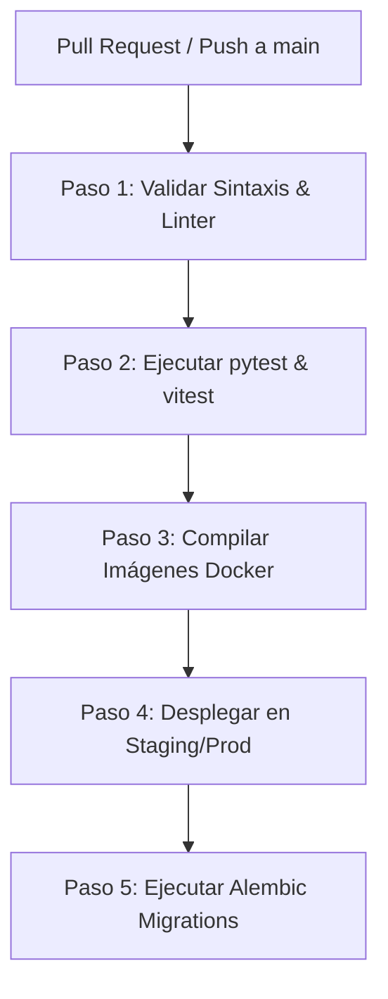

# Especificación Técnica: DevOps y CI/CD
**Propósito**: Definir la estrategia de despliegue, contenedorización, configuración de entornos, gestión de secretos y ejecución de migraciones de base de datos para el MVP.

---

## 1. Estrategia de Entornos

El sistema mantendrá tres entornos separados con configuraciones diferenciadas:

| Entorno | Propósito | Infraestructura de Referencia | Canales de Meta Asociados |
|---|---|---|---|
| **Development** | Desarrollo local y pruebas rápidas. | Docker Compose en máquina local. | Sandbox de Meta / Chat Web local. |
| **Staging** | Pruebas integrales y validación del cliente. | Instancia en la nube (ej. Render, AWS EC2). | Cuentas de prueba de WhatsApp y Facebook. |
| **Production** | Entorno real de cara al usuario final. | Servidor en la nube con escalamiento básico y HTTPS. | Números y páginas comerciales de producción. |

---

## 2. Contenedores (Docker y Docker Compose)

El monolito se empaqueta en dos imágenes Docker independientes para facilitar su distribución.

### 2.1 Docker Compose de Desarrollo Local (`docker-compose.yml`)
```yaml
version: '3.8'

services:
  db:
    image: pgvector/pgvector:pg16
    container_name: sc_db
    ports:
      - "5432:5432"
    environment:
      POSTGRES_USER: sc_user
      POSTGRES_PASSWORD: sc_password
      POSTGRES_DB: san_cristobal_db
    volumes:
      - postgres_data:/var/lib/postgresql/data

  backend:
    build:
      context: ./backend
      dockerfile: Dockerfile
    container_name: sc_backend
    ports:
      - "8000:8000"
    environment:
      - DATABASE_URL=postgresql://sc_user:sc_password@db:5432/san_cristobal_db
      - JWT_SECRET_KEY=dev_secret_key_12345
      - LLM_PROVIDER=openai
      - LLM_API_KEY=mock-key
      - META_VERIFY_TOKEN=dev_verify_token
    volumes:
      - ./backend:/app
    depends_on:
      - db

  frontend:
    build:
      context: ./frontend
      dockerfile: Dockerfile
    container_name: sc_frontend
    ports:
      - "5173:5173"
    volumes:
      - ./frontend:/app

volumes:
  postgres_data:
```
> [!IMPORTANT]
> El servicio `db` utiliza la imagen `pgvector/pgvector:pg16` para dar soporte nativo al almacenamiento y búsqueda de embeddings requeridos en el módulo RAG.

---

## 3. Pipeline de Integración y Entrega Continua (CI/CD)

Se define un flujo automatizado mediante **GitHub Actions** configurado en `.github/workflows/deploy.yml`:



1. **Linting e Integridad**: Verificación automática de formato con `ruff` (Python) y `eslint` (TypeScript).
2. **Ejecución de Pruebas**: Se levanta un contenedor PostgreSQL temporal en el GitHub Runner para correr las pruebas unitarias y de integración del backend y frontend.
3. **Build & Push**: Si las pruebas son exitosas, se compilan las imágenes Docker definitivas y se suben al Container Registry del proyecto.
4. **Despliegue**: Notificación de actualización al host del entorno correspondiente.
5. **Migraciones**: Ejecución automatizada de cambios en el esquema de base de datos.

---

## 4. Estrategia de Migraciones de Base de Datos

Las modificaciones sobre el esquema SQL se controlan estrictamente a través de **Alembic**.

- **Generación de Migraciones**: En desarrollo local, tras modificar un modelo SQLAlchemy en `app/models/`, el desarrollador genera un archivo de migración versionado:
  `docker-compose exec backend alembic revision --autogenerate -m "descriptivo"`
- **Despliegue Seguro**: El pipeline de CI/CD (o el script de inicio del contenedor backend) ejecuta el comando `alembic upgrade head` antes de levantar el servidor web FastAPI. Esto garantiza que la base de datos se actualice sin intervenciones manuales y previene inconsistencias de esquema.

---

## 5. Gestión de Variables de Entorno y Secretos

Los secretos sensibles del sistema nunca deben estar en el código fuente. Se inyectan en tiempo de ejecución en los contenedores desde el administrador de secretos de la plataforma de hosting:

- **`DATABASE_URL`**: Cadena de conexión JDBC/ODBC a PostgreSQL.
- **`JWT_SECRET_KEY`**: Semilla criptográfica de alta entropía para firma de tokens de usuarios.
- **`LLM_PROVIDER`**: Define la redirección del módulo IA (`openai`, `gemini`, `anthropic`).
- **`LLM_API_KEY`**: Credenciales de pago para invocar la API generativa.
- **`META_VERIFY_TOKEN`**: Token secreto de validación de Meta Webhook (GET).
- **`META_APP_SECRET`**: Clave de Meta para verificar firmas criptográficas `X-Hub-Signature-256` en los POSTs de webhooks.
- **`META_ACCESS_TOKEN`**: System User Token de larga duración para llamar a la API de envío de mensajes.

---

## 6. Referencias Cruzadas

- [02-arquitectura.md](file:///C:/Users/HENRY/Desktop/PROYECTO_FINAL/Spec/docs/specs/02-arquitectura.md): Estructura de código y dependencias contenidas en las imágenes Docker.
- [03-esquema-base-datos.md](file:///C:/Users/HENRY/Desktop/PROYECTO_FINAL/Spec/docs/specs/03-esquema-base-datos.md): Estructura del esquema SQL sobre el que opera Alembic.
- [07-estrategia-pruebas.md](file:///C:/Users/HENRY/Desktop/PROYECTO_FINAL/Spec/docs/specs/07-estrategia-pruebas.md): Ejecución automatizada de tests integrada en el pipeline.
